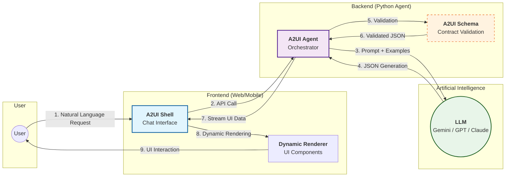

# A2UI Architecture (Agent-to-UI) - Presentation Overview

This diagram illustrates the macro logical flow of the A2UI system, focusing on the interaction between the User, Agent, and Artificial Intelligence.

## Key System Highlights

1.  **Natural Language → Real UI:** The user interacts with AI to generate complex interfaces without writing code.
2.  **Server-Driven Architecture (SDUI):** UI logic and structure reside on the server (Agent), keeping the frontend lightweight and cross-platform.
3.  **The JSON Contract (A2UI Schema):** A structured format ensuring the AI generates only valid interfaces compatible with renderer components.
4.  **Real-Time Validation:** The Agent validates LLM output before it reaches the user, correcting any generation errors.
5.  **Streaming & Interactivity:** Native support for incremental updates and user actions (buttons, forms) that flow back to the Agent to close the feedback loop.
