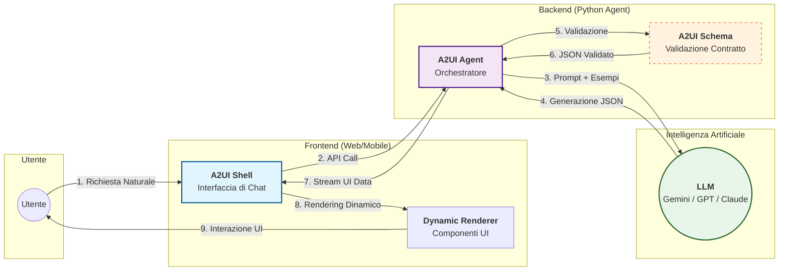

# Architettura A2UI (Agent-to-UI) - Panoramica per Presentazione

Questo diagramma illustra il flusso logico macro del sistema A2UI, focalizzandosi sull'interazione tra Utente, Agente e Intelligenza Artificiale.

## Punti Chiave del Sistema

1.  **Linguaggio Naturale → UI Reale:** L'utente interagisce con l'AI per generare interfacce complesse senza scrivere codice.
2.  **Architettura Server-Driven (SDUI):** La logica e la struttura della UI risiedono sul server (Agente), rendendo il frontend leggero e cross-platform.
3.  **Il Contratto JSON (A2UI Schema):** Un formato strutturato che garantisce che l'AI generi solo interfacce valide e compatibili con i componenti del renderer.
4.  **Validazione in Tempo Reale:** L'Agente convalida l'output dell'LLM prima che raggiunga l'utente, correggendo eventuali errori di generazione.
5.  **Streaming & Interattività:** Supporto nativo per aggiornamenti incrementali e azioni utente (bottoni, form) che tornano all'Agente per chiudere il ciclo di feedback.
